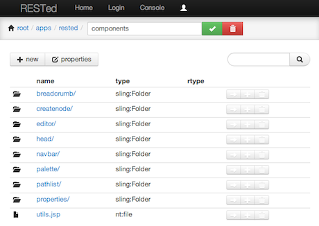
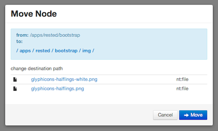
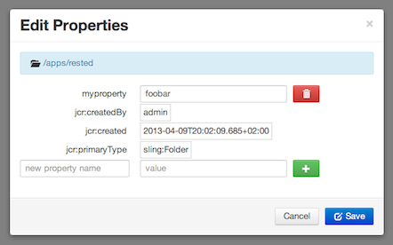

RESTed
======

REST-full editor for Apache Sling.

## What does it mean? ##

### REST-full ###

All operations operations follow REST-full conventions. Each operation is represented by unique (and human redable) path
and is stateless.

	GET /apps/rested/components.edit.html

### Built for Apache Sling ###

The RESTed tries very hard to stay 'true' to the Apache Sling.
In this respect, it could be thought of as just a set of selector scripts which provide UI interface to modify 
content in one way or other. For example, _.moveto_ whould enable a user to move a node to new location 
whereas _.remove_ would remove it.

	GET /path/node.moveto.html/another/path
	GET /path/node.copyto.html/another/path
	GET /path/node.remove.html
	GET /path/node.edit.html
	GET /path/node.create.html
	GET /path/node.properties.html

### Server-side JSP (no javascript)  ###

The application is written entirely in JSP, which makes it possible to use it in enviroments without javascript or CSS support.
This means RESTed will actually work in the lynx :-).

### Using Sling's POST servlet ###

The RESTed relies on (enhanced) POST servlet to manipulate content.

